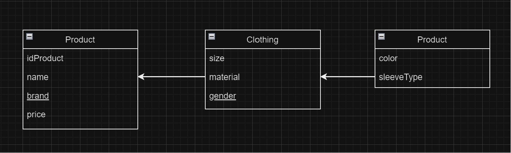
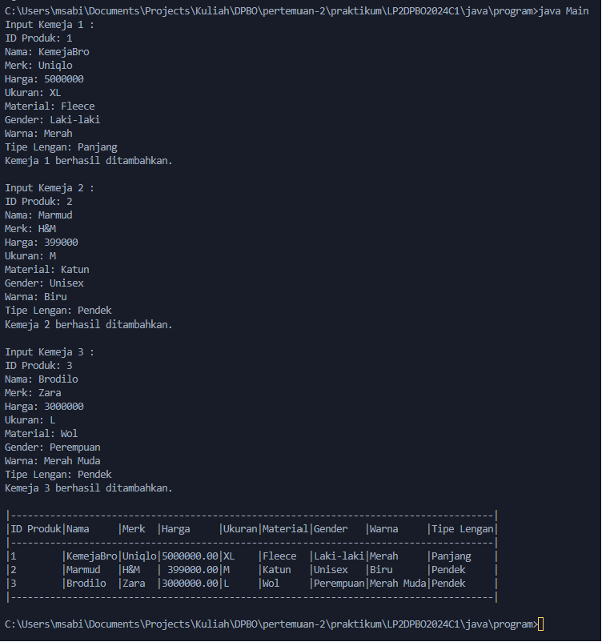

# LP2DPBO2024C1

Saya Muhamad Sabil Fausta NIM 2210142 mengerjakan Latihan 1 dalam mata kuliah Desain dan Pemrograman Berorientasi Objek untuk keberkahanNya maka saya tidak melakukan kecurangan seperti yang telah dispesifikasikan. Aamiin.

# Desain Alur dan Diagram Kelas

Kelas Product
idProduct: Menyimpan identifikasi unik untuk produk. Tipe data yang digunakan adalah integer karena biasanya berupa increment.
name: Menyimpan nama produk. Tipe data String dipilih karena nama produk adalah urutan karakter.
brand: Menyimpan merek produk. Sama seperti name, String digunakan karena merek diwakili sebagai urutan karakter.
price: Menyimpan harga produk. Tipe data double dipilih karena harga bisa memiliki komponen desimal, membutuhkan presisi yang lebih tinggi dari double.

Kelas Clothing (extends Product)
size: Menyimpan ukuran pakaian. String dipilih sebagai tipe data karena ukuran pakaian sering kali diwakili dalam kombinasi angka dan huruf (misalnya, S, M, L, XL) dan bukan hanya nilai numerik.
material: Menyimpan material atau bahan dari pakaian. String digunakan karena material pakaian diwakili sebagai teks.
gender: Menyimpan informasi gender target pakaian. String dipilih karena gender biasanya diwakili dalam bentuk teks.

Kelas Shirt (extends Clothing)
color: Menyimpan informasi warna kemeja. String adalah pilihan yang tepat karena warna sering diwakili sebagai nama (misalnya, merah, biru).
sleeveType: Menyimpan tipe lengan kemeja. Tipe data String digunakan karena tipe lengan diwakili dalam bentuk teks, seperti lengan panjang, lengan pendek, atau tanpa lengan.

Semua kelas yang saya gunakan adalah protected karena sesuai dengan konsep OOP di inheritence dimana supaya yang bisa aksesnya adalah kelas itu sendiri dan sub classnya juga bisa akses.

# Desain Program dan Penjelasan

Diatas merupakan program saat dijalankan, user diminta untuk menginputkan 3 data kemeja yang setelah semuanya diinputkan akan tedapat notifikasi berhasil dan juga muncul datatable yang isinya adalah data yang sebelumnya sudah diinputkan
